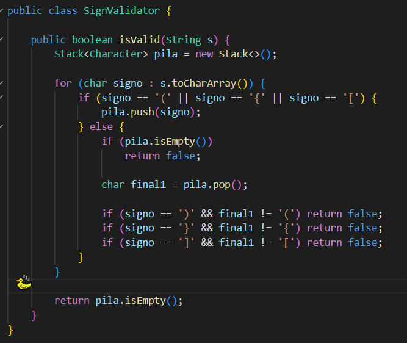
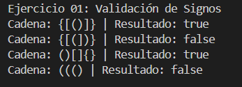
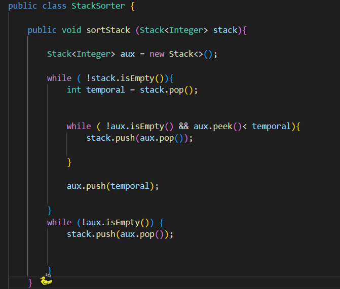
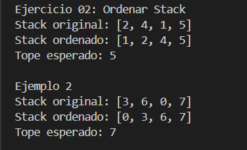
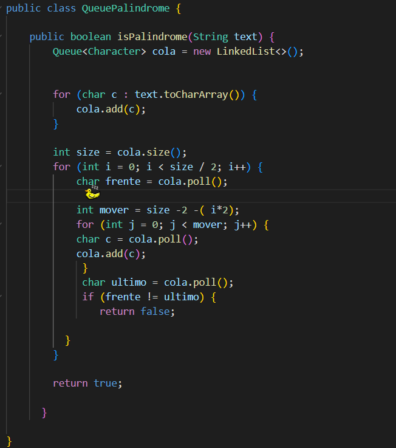
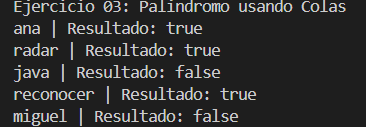

# Práctica:  Ejercicios de lógica con estructuras lineales: pilas y colas

## Nombres de los estudiantes:
- **Miguel Maza**
- **Martin Villacres**
- **David Fajardo**
- **Curso:** Computacion grupo 1
- **Fecha:** 12/6/2026

## Descripción general del proyecto
El proyecto busca implementar 3 usos prácticos de pilas y colas en diferentes situaciones lógicas
Desde ordenar un stack, verificar si una palabra es palíndromo, hasta verificar signos de apertura y cierre
de manera lógica y ordenada. Aunque las pilas y colas no esten pensadas explícitamente para tareas como organizad
datos, se puede presentar adaptaciones de estas para cumplir con dicho propósito.
## Explicación del Ejercicio 01:
El método del ejercicio 1 recibe como parámetro un String que contiene signos de agrupación en cierto orden, para
verificar que se cierren en el orden correcto, se apilan en una pila auxiliar los signos de apertura.
En el momento que aparece un signo de cierre, entonces se verifica si este pertenece al último elemento de la pila
ya que este debería ser el primero en cerrarse, si coincide, extrae otro valor del String y la pila pierde un elemento.
Si alguna de estas comparaciones es Falsa, entonces se retorna el boleano false y termina el método.
## Explicación del Ejercicio 02:
Se creo una pila auxiliar que trabaja en conjunto con la original para organizar un Stack, se empieza por extraer los elementos
de la pila original y compararlos con la auxiliar, enviando los mayores a la original momentáneamente para organizar primero los menores
y agregar los mayores arriba. Este bucle se repite hasta que la pila este vacía.
## Explicación del Ejercicio 03:
Se usan dos estructuras, una pila y una cola, en ambos se agregan los caracteres del String uno por uno. La forma en la que funciona cada uno hará que uno termine con la palabra original y otro con la palabra invertida. Al final, comparando la palabra reconstruida de ambas estructuras podemos verificar si son palíndromos o no. Retornando la variable booleana según el caso.

## Codigo del Ejercicio 1

## Salida del Ejercicio 1

## Codigo del Ejercicio 2

## Salida del Ejercicio 2

## Codigo del Ejercicio 3

## Salida del Ejercicio 3

## Conclusión 1:
Las pilas son útiles al momento de resolver problemas donde el inverso de una cadena tiene
cierta relevancia en la verificación, así mismo cuando se debe verificar un orden concreto
para validar una acción.
## Conclusión 2:
En muchos casos, se requiere el uso de estructuras auxiliares para lograr tareas complejas
usando en escencia, solo pilas o colas, demostrando así la flexibilidad en la resolución
de problemas siempre y cuando la solución este bien estructurada.
## Conclusión 3:
La combinación de ambas estructuras, tanto pilas como colas, permiten analizar y comparar información de distinta manera, o perspectivas, como lo fue en el caso de la verificación de palíndromos, aprovechando las características FIFO y LIFO de cada estructura para obtener resultados a comodidad de la solución.
## URL del release
https://github.com/David-Fajardo-LN/icc-est-u2-Ejercicios-Pilas-Colas/releases/tag/v2.0.2
